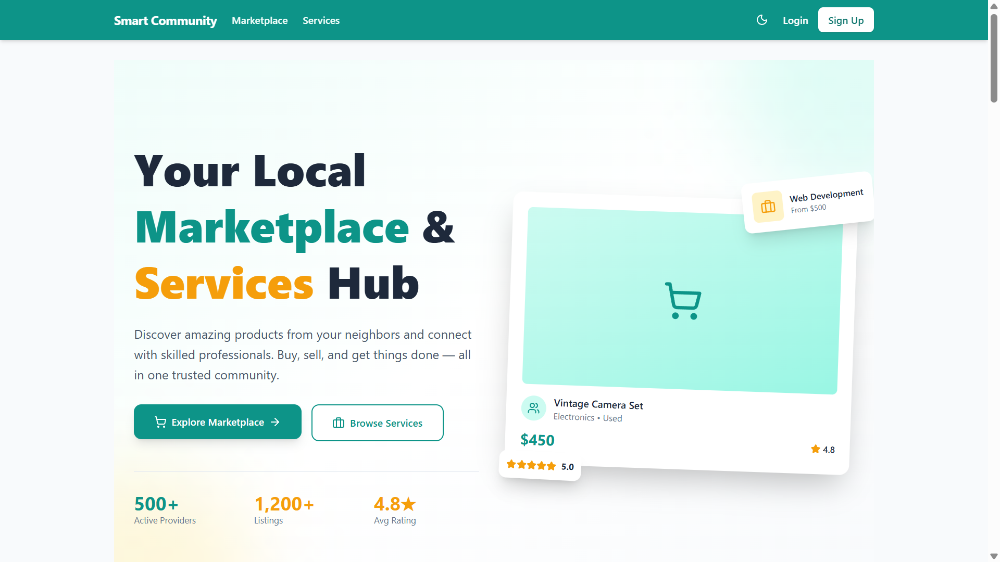

# Smart Community Marketplace

<p align="center">
  
</p>

A full-stack community marketplace where neighbors can **buy & sell products**, **hire skilled professionals**, and **chat in real time** — all within a trusted, review-driven community platform.

---

## ✨ Features

### 🛒 Marketplace (Products)
- Browse, search, and filter products by keyword, category, and price range
- Upload up to 5 images per listing (stored on Cloudinary)
- Product condition tracking (new / used)
- Admin approval workflow before listings go live
- Mark products as sold or manage sales through orders

### 📦 Orders & Checkout
- Secure product checkout using Demo Card or Cash on Delivery (COD)
- Interactive checkout modal with shipping address inputs
- Order tracking for buyers (My Purchases) and sellers (My Sales)
- Real-time seller notifications upon receiving a new order
- Order fulfillment workflow: `pending → confirmed → shipped → delivered → cancelled`
- Automatic status updates (e.g. marking products as `sold` on order, releasing back to `active` if cancelled)

### 🔧 Services
- Offer and discover local services (Web Dev, Design, Tutoring, Home Repair, etc.)
- Portfolio image uploads per service
- Delivery time and pricing display
- Admin approval before services are published

### 📅 Bookings
- Book services with a scheduled date and custom message
- Full status lifecycle: `pending → accepted → rejected → completed → cancelled`
- Booking detail pages with status history

### 💬 Real-time Chat
- Socket.IO-powered messaging between any two users
- Conversation list with unread message counts
- Typing indicators
- Online/offline user presence

### 🔔 Notifications
- In-app notifications for booking updates, messages, and reviews
- Unread badge count in the navbar
- Mark individual or all notifications as read
- Real-time delivery via Socket.IO

### ⭐ Reviews & Ratings
- Review users, products, and services
- Automatic average rating recalculation on create/update/delete
- One review per user per target (enforced)

### ❤️ Favorites
- Save products and services to a personal favorites list

### 👤 User Profile & Dashboard
- Edit profile: name, bio, avatar, location, contact, skills
- Dashboard with stats: listings, bookings, reviews, earnings
- Recent activity feed

### 🌗 Dark Mode
- Persistent light/dark theme toggle

### 🛡️ Admin Panel
- Platform-wide statistics overview
- User management: change roles, suspend, delete accounts
- Content approval: approve or reject pending products & services
- View all bookings across the platform

---

## 🧰 Tech Stack

### Backend
| Package | Purpose |
|---------|---------|
| **Node.js + Express 5** | HTTP server & API routing |
| **MongoDB + Mongoose** | Database & ODM |
| **Socket.IO** | Real-time messaging & notifications |
| **JSON Web Tokens (JWT)** | Stateless authentication |
| **bcryptjs** | Password hashing |
| **Cloudinary** | Cloud image storage |
| **Multer** | Multipart file upload handling |
| **express-validator** | Request input validation |
| **dotenv** | Environment variable management |

### Frontend
| Package | Purpose |
|---------|---------|
| **React 19 + Vite** | UI framework & build tool |
| **React Router v7** | Client-side routing |
| **Axios** | HTTP client with auth interceptor |
| **Socket.IO Client** | Real-time events |
| **TailwindCSS v4** | Utility-first styling |
| **Framer Motion** | Animations & transitions |
| **Lucide React** | Icon library |

---

## 📁 Project Structure

```
Smart-Community-Marketplace/
├── Backend/
│   ├── config/
│   │   ├── db.js              # MongoDB connection
│   │   └── cloudinary.js      # Cloudinary setup
│   ├── controllers/           # Business logic
│   │   ├── authController.js
│   │   ├── productController.js
│   │   ├── serviceController.js
│   │   ├── bookingController.js
│   │   ├── messageController.js
│   │   ├── reviewController.js
│   │   ├── notificationController.js
│   │   ├── favoriteController.js
│   │   ├── dashboardController.js
│   │   ├── userController.js
│   │   ├── adminController.js
│   │   └── orderController.js
│   ├── middleware/
│   │   ├── auth.js            # JWT protect & admin guard
│   │   ├── errorHandler.js    # Global error handler
│   │   └── upload.js          # Multer memory storage
│   ├── models/
│   │   ├── User.js
│   │   ├── Product.js
│   │   ├── Service.js
│   │   ├── Booking.js
│   │   ├── Message.js
│   │   ├── Conversation.js
│   │   ├── Review.js
│   │   ├── Notification.js
│   │   ├── Favorite.js
│   │   └── Order.js
│   ├── routes/                # Express routers
│   ├── utils/                 # Helper utilities
│   ├── seed.js                # Database seeder
│   └── server.js              # Entry point
│
├── Frontend/
│   ├── public/
│   └── src/
│       ├── api/
│       │   └── axios.js       # Axios instance + auth interceptor
│       ├── components/
│       │   ├── Layout.jsx     # Navbar, sidebar, shell
│       │   ├── BookingModal.jsx
│       │   ├── CheckoutModal.jsx
│       │   ├── FavoriteButton.jsx
│       │   ├── Notifications.jsx
│       │   ├── ProtectedRoute.jsx
│       │   └── ReviewSection.jsx
│       ├── context/
│       │   ├── AuthContext.jsx
│       │   ├── SocketContext.jsx
│       │   └── ThemeContext.jsx
│       ├── pages/
│       │   ├── Home.jsx
│       │   ├── DashboardPage.jsx
│       │   ├── FavoritesPage.jsx
│       │   ├── auth/          # Login, Register
│       │   ├── products/      # List, Detail, Create/Edit
│       │   ├── services/      # List, Detail, Create/Edit
│       │   ├── bookings/      # List, Detail
│       │   ├── orders/        # Orders history list
│       │   ├── chat/          # Conversations, Chat window
│       │   ├── profile/       # View, Edit
│       │   └── admin/         # Dashboard, Users, Listings
│       ├── App.jsx
│       └── main.jsx
│
├── vercel.json                # Vercel SPA routing config (Frontend)
└── README.md
```

---

## 🚀 Local Development Setup

### Prerequisites
- Node.js v18+
- MongoDB (local) or a [MongoDB Atlas](https://cloud.mongodb.com) cluster
- [Cloudinary](https://cloudinary.com) account (free tier is fine)

---

### Backend

```bash
cd Backend
npm install
```

Create `Backend/.env`:

```env
NODE_ENV=development
PORT=5000
MONGO_URI=mongodb://localhost:27017/smart-community
JWT_SECRET=your_long_random_secret_here
CLOUDINARY_CLOUD_NAME=your_cloud_name
CLOUDINARY_API_KEY=your_api_key
CLOUDINARY_API_SECRET=your_api_secret
FRONTEND_URL=http://localhost:5173
```

Start the server:

```bash
npm run dev        # development (nodemon)
npm start          # production
```

Backend runs on → `http://localhost:5000`

> **Optional**: Seed the database with sample data:
> ```bash
> node seed.js
> ```

---

### Frontend

```bash
cd Frontend
npm install
```

Create `Frontend/.env`:

```env
VITE_API_URL=http://localhost:5000/api
VITE_SOCKET_URL=http://localhost:5000
```

Start the dev server:

```bash
npm run dev
```

Frontend runs on → `http://localhost:5173`

---

## ☁️ Deployment

### Backend → Railway (required for Socket.IO)

> Vercel is serverless and **cannot** run Socket.IO. Deploy the backend on [Railway](https://railway.app) or [Render](https://render.com).

1. Push your repo to GitHub
2. Go to [railway.app](https://railway.app) → **New Project → Deploy from GitHub**
3. Set **Root Directory** to `Backend`
4. Add environment variables (same as `.env` above, with `NODE_ENV=production`)
5. Copy the Railway-generated URL (e.g. `https://your-app.up.railway.app`)

### Frontend → Vercel

1. Go to [vercel.com](https://vercel.com) → **Add New Project → Import GitHub repo**
2. Set **Root Directory** to `Frontend`
3. Framework Preset: **Vite**
4. Add environment variables:
   ```
   VITE_API_URL=https://your-app.up.railway.app/api
   VITE_SOCKET_URL=https://your-app.up.railway.app
   ```
5. Deploy — Vercel auto-handles SPA routing via `vercel.json`

6. After deploying, go back to Railway and add:
   ```
   FRONTEND_URL=https://your-app.vercel.app
   ```

---

## 📡 API Reference

### Auth
| Method | Endpoint | Access |
|--------|----------|--------|
| POST | `/api/auth/register` | Public |
| POST | `/api/auth/login` | Public |
| GET | `/api/auth/me` | Private |
| POST | `/api/auth/forgotpassword` | Public |
| PUT | `/api/auth/resetpassword/:token` | Public |

### Users
| Method | Endpoint | Access |
|--------|----------|--------|
| GET | `/api/users/:id` | Public |
| PUT | `/api/users/profile` | Private |

### Products
| Method | Endpoint | Access |
|--------|----------|--------|
| GET | `/api/products` | Public |
| GET | `/api/products/:id` | Public |
| POST | `/api/products` | Private |
| PUT | `/api/products/:id` | Private (owner) |
| DELETE | `/api/products/:id` | Private (owner) |

### Services
| Method | Endpoint | Access |
|--------|----------|--------|
| GET | `/api/services` | Public |
| GET | `/api/services/:id` | Public |
| POST | `/api/services` | Private |
| PUT | `/api/services/:id` | Private (owner) |
| DELETE | `/api/services/:id` | Private (owner) |

### Bookings
| Method | Endpoint | Access |
|--------|----------|--------|
| GET | `/api/bookings` | Private |
| GET | `/api/bookings/:id` | Private |
| POST | `/api/bookings` | Private |
| PUT | `/api/bookings/:id/status` | Private |

### Messages
| Method | Endpoint | Access |
|--------|----------|--------|
| GET | `/api/messages/conversations` | Private |
| POST | `/api/messages/conversations` | Private |
| GET | `/api/messages/conversations/:id` | Private |
| POST | `/api/messages/conversations/:id` | Private |
| GET | `/api/messages/unread-count` | Private |

### Reviews
| Method | Endpoint | Access |
|--------|----------|--------|
| GET | `/api/reviews/:targetType/:targetId` | Public |
| POST | `/api/reviews` | Private |
| GET | `/api/reviews/my-reviews` | Private |
| PUT | `/api/reviews/:id` | Private (owner) |
| DELETE | `/api/reviews/:id` | Private (owner) |

### Favorites
| Method | Endpoint | Access |
|--------|----------|--------|
| GET | `/api/favorites` | Private |
| POST | `/api/favorites` | Private |
| DELETE | `/api/favorites/:id` | Private |

### Notifications
| Method | Endpoint | Access |
|--------|----------|--------|
| GET | `/api/notifications` | Private |
| GET | `/api/notifications/unread` | Private |
| GET | `/api/notifications/unread-count` | Private |
| PUT | `/api/notifications/:id/read` | Private |
| PUT | `/api/notifications/read-all` | Private |
| DELETE | `/api/notifications/:id` | Private |

### Dashboard
| Method | Endpoint | Access |
|--------|----------|--------|
| GET | `/api/dashboard/stats` | Private |
| GET | `/api/dashboard/activity` | Private |

### Orders
| Method | Endpoint | Access |
|--------|----------|--------|
| POST | `/api/orders` | Private |
| GET | `/api/orders/my-purchases` | Private (buyer) |
| GET | `/api/orders/my-sales` | Private (seller) |
| PUT | `/api/orders/:id/status` | Private (seller/admin) |

### Admin
| Method | Endpoint | Access |
|--------|----------|--------|
| GET | `/api/admin/stats` | Admin |
| GET | `/api/admin/users` | Admin |
| PUT | `/api/admin/users/:id` | Admin |
| DELETE | `/api/admin/users/:id` | Admin |
| GET | `/api/admin/products` | Admin |
| GET | `/api/admin/products/pending` | Admin |
| PUT | `/api/admin/products/:id/status` | Admin |
| GET | `/api/admin/services` | Admin |
| GET | `/api/admin/services/pending` | Admin |
| PUT | `/api/admin/services/:id/status` | Admin |
| GET | `/api/admin/bookings` | Admin |

### Health Check
| Method | Endpoint | Access |
|--------|----------|--------|
| GET | `/api/health` | Public |

---

## 🔌 Socket.IO Events

### Client → Server
| Event | Payload | Description |
|-------|---------|-------------|
| `user_online` | `userId` | Register user presence |
| `join_conversation` | `conversationId` | Join a chat room |
| `leave_conversation` | `conversationId` | Leave a chat room |
| `send_message` | `{ conversationId, message }` | Send a chat message |
| `typing` | `{ conversationId, userId, name }` | Typing indicator |
| `stop_typing` | `{ conversationId, userId }` | Stop typing |
| `send_notification` | `{ recipientId, notification }` | Push notification to user |
| `notification_read` | `notificationId` | Acknowledge that a notification was read |

### Server → Client
| Event | Payload | Description |
|-------|---------|-------------|
| `online_users` | `userId[]` | Updated online user list |
| `receive_message` | `message` | New incoming message |
| `user_typing` | `{ conversationId, userId, name }` | Typing indicator |
| `user_stop_typing` | `{ conversationId, userId }` | Stopped typing |
| `receive_notification` | `notification` | New notification |
| `notification_acknowledged` | `{ notificationId }` | Confirms receipt/read status of notification |

---

## 🗄️ Data Models

### User
`name` · `email` · `password` · `avatar` · `bio` · `contactNumber` · `location` · `skills[]` · `role (user/admin)` · `ratingAvg` · `ratingCount` · `isSuspended`

### Product
`title` · `description` · `images[]` · `price` · `category` · `condition (new/used)` · `location` · `sellerId` · `status (pending/active/rejected/sold)` · `ratingAvg` · `ratingCount`

### Service
`title` · `description` · `price` · `deliveryTimeInDays` · `category` · `portfolioImages[]` · `availability` · `providerId` · `status (pending/active/rejected)` · `ratingAvg` · `ratingCount`

### Booking
`service` · `client` · `provider` · `message` · `scheduledDate` · `totalPrice` · `status (pending/accepted/rejected/completed/cancelled)`

### Order
`productId` · `buyerId` · `sellerId` · `quantity` · `totalPrice` · `shippingAddress { fullName, phone, addressLine, city, postalCode }` · `paymentMethod (cash_on_delivery/demo_card)` · `status (pending/confirmed/shipped/delivered/cancelled)`

### Review
`reviewerId` · `targetId` · `targetType (User/Service/Product)` · `rating (1–5)` · `comment` · `bookingId`

### Notification
`recipientId` · `type` · `title` · `message` · `relatedId` · `relatedModel` · `isRead`

### Conversation
`participants[]` · `lastMessage` · `lastMessageAt`

### Message
`conversationId` · `senderId` · `content` · `isRead`

---

## 👥 User Roles

| Role | Capabilities |
|------|-------------|
| `user` | Full access to marketplace, services, bookings, orders, chat, reviews, favorites, dashboard |
| `admin` | All user capabilities + admin panel (user management, content approval, platform stats) |

---

## 🔍 Code Review & Architecture Insights

Following a detailed review of the code in the repository, here are several engineering insights, design patterns, and recommendations:

### 🏗️ Backend Review (Express & MongoDB)
- **RESTful Endpoints**: The routing is highly modularized (`/api/auth`, `/api/users`, `/api/products`, etc.) with consistent middleware application (JWT protection via `protect` and admin guard authorization).
- **Data Integrity & Recalculation**: Reviews implement automatic pre/post hooks or logic to recalculate a user/product/service's average rating and review counts on creation/update/deletion. This prevents stale aggregates in the database.
- **Real-Time Integration**: The API endpoints are nicely coupled with Socket.IO. Actions like creating orders, bookings, or messages automatically store the notification record in MongoDB and emit real-time events to online users, maintaining synchronous app state.
- **Room for Improvement**:
  - **MongoDB Indexes**: Currently, fields like `sellerId`, `buyerId`, `reviewerId`, and `status` are heavily queried in filters and sorting but lack database indexes in Mongoose models. Adding indexes (e.g. `{ buyerId: 1, createdAt: -1 }`) will significantly improve query execution speeds as the dataset grows.
  - **Error Handling Consistency**: The application uses a custom global `errorHandler` middleware. Some controllers throw standard errors, while others could benefit from an explicit `next(error)` catch block to avoid unhandled rejections on asynchronous middleware operations.

### 🎨 Frontend Review (React 19 & TailwindCSS)
- **State Management**: The application utilizes context providers (`AuthContext`, `SocketContext`, `ThemeContext`) for global states, ensuring clean separations of concern.
- **API Layer Modularization**: Several components communicate directly via custom API files (`orderApi`, `reviewApi`, `adminApi`), though others fallback to direct `api/axios` client requests. Standardizing all routes into modular API wrappers increases code reusability and mockability for testing.
- **Animations & UX**: Utilizing Framer Motion and Lucide icons enhances UI fluidness and provides micro-animations that feel polished and interactive.
- **TailwindCSS Configuration**: The application leverages TailwindCSS v4 configurations, utilizing utility classes for dark mode (`dark:`) and grid layouts efficiently.

---

## 📄 License

This project is licensed under the **ISC License**.
